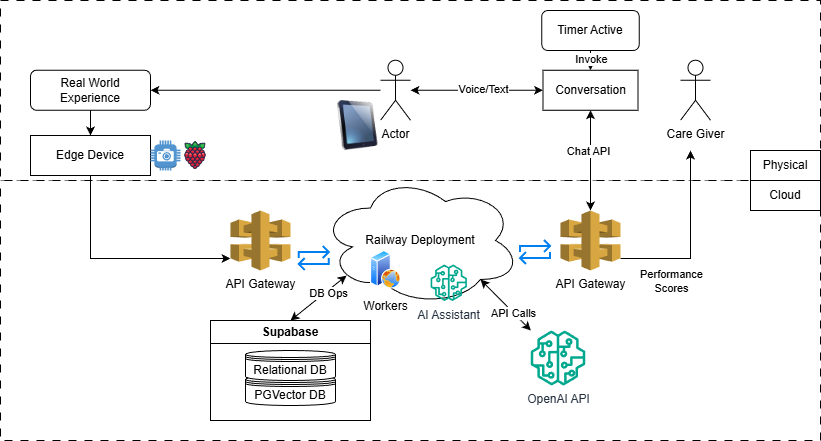

# MemerAI

<div align="center">

**AI-Powered Memory Training System for Alzheimer's Care**

[](https://developer.apple.com/ios/)
[](https://swift.org/)
[](https://www.python.org/)
[](LICENSE)

*Helping Alzheimer's patients reconnect with their memories through AI-powered daily training*

[Overview](#overview) • [Features](#features) • [Architecture](#architecture) • [Getting Started](#getting-started) • [Documentation](#documentation)

</div>

---

## 📖 Overview

MemorAI is an end-to-end AI system designed to help Alzheimer's patients maintain and strengthen their memory through automatic event capture, intelligent training sessions, and caregiver supervision. Built during the 2025 AI Hackathon, MemorAI brings evidence-based cognitive therapy into everyday living environments.

### The Problem

Over **7.2 million Americans** aged 65+ live with Alzheimer's disease, with caregivers providing **18.4 billion hours of unpaid care annually**. The medial temporal lobe/hippocampal system—responsible for encoding new episodic memories—degrades early in Alzheimer's, causing:

- Inability to remember recent events ("What happened yesterday?")
- Repetitive questioning that exhausts caregivers
- Loss of connection with daily life and loved ones
- Disorientation and anxiety

### Our Solution

MemorAI automatically captures a patient's daily experiences through a wearable device, stores them in a multimodal memory database, and guides patients through evidence-based memory training sessions each morning. A caregiver dashboard provides supervision, error correction, and progress tracking—implementing true **human-in-the-loop AI**.

**Key Innovation**: Rather than waiting for weekly clinic sessions, MemorAI delivers **daily micro-training** aligned with cognitive stimulation therapy and spaced retrieval methods proven to improve memory recall.

---

## ✨ Features

### 🎯 Core Capabilities

- **Automatic Context Capture**: Wearable device with camera and microphone records daily events, people, and conversations
- **Voice Recognition**: Detects when patient is speaking (70% similarity threshold, 100% tested accuracy)
- **Face Recognition**: Identifies family members and frequent visitors using MediaPipe + MobileFaceNet
- **Multimodal Memory Storage**: Relational + vector database stores structured events and embeddings
- **Adaptive Training Sessions**: AI-powered questions with progressive hints (never reveals answers directly)
- **Image-Based Recall**: Photo recognition training for long-term memory (family, relationships)
- **Text-Based Recall**: Event-based questions for short-term memory (yesterday's activities)
- **Caregiver Dashboard**: Real-time metrics, progress tracking, and error correction

### 📊 Cognitive Metrics Tracked

- **Learning Curve**: Performance improvement over sessions
- **Forgetting Curve**: Memory retention over time (1h, 8h, 1d, 2d, 5d, 7d)
- **Q/A Correct Rate**: Overall accuracy percentage
- **Attempts to Answer**: Distribution of first-try vs. multiple-attempt success
- **Weekly Progress**: Long-term trend analysis
- **Memory Type Classification**: Short-term vs. long-term memory differentiation

### 📱 User Experience

- **iOS Native App**: Beautiful journal-style interface with SwiftUI
- **Chat Interface**: Conversational AI assistant for natural interaction
- **Siri Shortcuts**: "Hey Siri, Start Memory Recall" voice activation
- **Daily Reminders**: Notifications to encourage regular practice
- **Speech Integration**: Text-to-speech and speech recognition
- **MoCA Test Integration**: Montreal Cognitive Assessment for standardized screening

---

## 🏗️ Architecture

### System Overview



### Component Architecture

#### 1. **Wearable Device** (Raspberry Pi)
- **Location**: `raspberry-pi/`, `raspberry-confirmation/`
- **Technology**: Python, MediaPipe, Resemblyzer
- **Functions**:
  - Continuous audio recording (5-minute chunks)
  - Voice verification (patient vs. others)
  - Conditional photo capture (5-second intervals when patient speaks)
  - Face recognition and identification
  - GPS location tracking
  - Upload to cloud storage (Supabase)

#### 2. **Backend Services**
Multiple Flask APIs deployed on Railway:
- **Memory Training API** (`ai_memory_trainer/`)
  - Session management (warmup → training → summary)
  - Question selection by least recent use
  - LLM-based answer evaluation with progressive hints
  - Q&A database with success rate tracking
  - API: `https://2025-ai-hackathon-raspberry-api-api-production-5bd5.up.railway.app`

- **Voice Verification API** (`voice-training/`)
  - Resemblyzer deep learning speaker recognition
  - 70% similarity threshold
  - Trained on patient voice samples
  - Returns `should_take_photos` decision

- **Image Recognition API**
  - Photo-based memory questions
  - Face detection and matching
  - Progressive hint system
  - API: `https://2025-ai-hackathon-raspberry-api-api-production-bfcb.up.railway.app`

- **Face Detection Service** (`face_detection/`)
  - MediaPipe Face Detector (BlazeFace)
  - MobileFaceNet embeddings
  - Real-time face recognition

#### 3. **iOS Application** (Memora)
- **Location**: `ios_app/Memora/`
- **Technology**: SwiftUI, Combine, App Intents
- **Features**:
  - Memory training sessions (image + text)
  - Memory gallery for stored experiences
  - Chat interface with GPT-4o-mini
  - MoCA cognitive assessment viewer
  - Siri Shortcuts integration
  - Daily notification reminders
  - Haptic feedback and speech synthesis

#### 4. **Caregiver Dashboard**
- **Location**: `caregiver-dashboard/`
- **Technology**: React, TypeScript, Vite, Recharts
- **Features**:
  - Real-time cognitive metrics visualization
  - Learning and forgetting curve analysis
  - Session history and attempt tracking
  - Error correction interface
  - Event seeding and verification
  - Multi-patient support (future)

---

## 🚀 Getting Started

### Prerequisites

- **iOS Development**: Xcode 15.0+, iOS 16.0+
- **Python**: Python 3.9+
- **Node.js**: Node.js 16+
- **Hardware**: Raspberry Pi 4 (for wearable device)
- **API Keys**: OpenAI API key, Supabase credentials

### Quick Start

#### 1. Backend Services

```bash
# Memory Training API
cd 2025-AI-Hackathon/ai_memory_trainer
pip install -r requirements.txt
export OPENAI_API_KEY="your-key-here"
python api.py

# Voice Training API (optional - deployed on Railway)
cd ../voice-training
pip install -r requirements.txt
python app.py
```

#### 2. iOS Application

```bash
cd 2025-AI-Hackathon/ios_app
open Memerai.xcodeproj

# Configure API keys in:
# Memora/Config/APIConfig.swift

# Build and run (Cmd+R)
```

#### 3. Caregiver Dashboard

```bash
cd 2025-AI-Hackathon/caregiver-dashboard
npm install
npm run dev

# Access at http://localhost:5173
```

#### 4. Raspberry Pi Setup

```bash
cd 2025-AI-Hackathon/raspberry-pi
chmod +x setup.sh
./setup.sh

# Configure and run
python main.py
```

---

## 📚 Documentation

### API Documentation

- **[Memory Training API Guide](2025-AI-Hackathon/ai_memory_trainer/API_GUIDE.md)** - Session management, Q&A endpoints
- **[Voice Verification API](2025-AI-Hackathon/raspberry-confirmation/API_DOCUMENTATION.md)** - Voice recognition, upload endpoints
- **[Image Training API](2025-AI-Hackathon/ai_memory_trainer/prompt.md)** - Photo-based memory training
- **[Raspberry Pi Workflow](2025-AI-Hackathon/raspberry-confirmation/RASPBERRY_PI_WORKFLOW.md)** - Hardware setup and integration

### Component Guides

- **[iOS App README](2025-AI-Hackathon/ios_app/README.md)** - Features, architecture, usage
- **[Dashboard Metrics](2025-AI-Hackathon/caregiver-dashboard/METRICS_INTEGRATION.md)** - Real-time tracking and visualization
- **[Face Detection Setup](2025-AI-Hackathon/face_detection/README.md)** - MediaPipe configuration
- **[Memory Trainer Usage](2025-AI-Hackathon/ai_memory_trainer/README.md)** - Training session flow

---

## 🔬 Technical Details

### Machine Learning Models

- **Voice Recognition**: Resemblyzer (deep learning speaker embeddings)
- **Face Detection**: MediaPipe BlazeFace (TFLite)
- **Face Embeddings**: MobileFaceNet (ONNX)
- **Conversational AI**: OpenAI GPT-4o-mini / GPT-5-mini
- **Answer Evaluation**: LLM-based semantic matching with progressive hints

### Data Storage

- **Media Storage**: Supabase (audio recordings, photos)
- **Relational Data**: Supabase PostgreSQL (event metadata, person relationships)
- **Vector Database**: Embeddings for semantic search and recall
- **Local Storage**: iOS app memories, dashboard metrics (localStorage)

### Training Methodology

**Session Flow**:
1. **Warmup Phase** (5 min): Friendly conversation to ease into session
2. **Question Selection**: Least recently practiced questions (spaced retrieval)
3. **Training Phase**: Questions with 3 attempts max per question
4. **Progressive Hints**: Increasingly specific hints without revealing answers
5. **Summary**: Positive reinforcement and statistics

**Memory Classification**:
- **Long-Term Memory**: Family faces, relationships (photo-based)
- **Short-Term Memory**: Yesterday's events, meals, visitors (text-based)

### Performance Metrics

- **Voice Recognition**: 100% tested accuracy, <5s response time
- **Face Recognition**: Real-time processing, <100ms per frame
- **API Response**: <2s for training questions
- **Session Duration**: 15-30 minutes typical

---

## 🎯 Workflow Example

### Daily Cycle

**Morning (Patient)**:
```
1. iOS app sends notification: "Good morning! Ready for today's training?"
2. Patient opens app or uses Siri: "Hey Siri, Start Memory Recall"
3. Warmup conversation (5 min)
4. Training questions about yesterday:
   - "Who visited you yesterday?" [photo shown]
   - "What did you have for dinner?"
   - "Where did you go in the afternoon?"
5. Progressive hints if incorrect
6. Celebration and summary
```

**Throughout Day (Wearable)**:
```
1. Microphone records continuously (5-min chunks)
2. Upload audio to backend
3. Voice verification: Is patient speaking?
   - YES: Camera captures photos every 5 seconds
   - NO: Skip photos, wait for next cycle
4. Face recognition on captured photos
5. Store events in database with metadata:
   - Timestamp, location, detected persons, audio transcription
```

**Evening (Caregiver)**:
```
1. Open dashboard to review metrics
2. Check learning/forgetting curves
3. Correct any recognition errors:
   - "That's Uncle Bob, not a stranger"
4. Seed new important events:
   - "Tomorrow is granddaughter's birthday"
5. Review question difficulty and adjust
```

---

## 🧪 Evidence-Based Approach

### Clinical Foundation

- **Cognitive Stimulation Therapy**: Meta-analysis shows ~+2 MMSE points vs. usual care
- **Spaced Retrieval**: Rehearsal of meaningful events increases recall
- **Real-World Memory Aids**: Environmental cues improve orientation
- **Repetitive Questioning Reduction**: Direct caregiver burden relief

### References

1. [Hippocampus and Alzheimer's Disease](https://pmc.ncbi.nlm.nih.gov/articles/PMC8807768/)
2. [Repetitive Questioning Exasperates Caregivers](https://pmc.ncbi.nlm.nih.gov/articles/PMC5768244/)
3. [2025 Alzheimer's Facts and Figures](https://pmc.ncbi.nlm.nih.gov/articles/PMC12040760/)
4. [Caregiver Stressors Report](https://www.alz.org/news/2024/new-alzheimers-association-report-reveals-top-stressors-caregivers/)

---

## 🛣️ Roadmap

### Current Features (v1.0)
- ✅ Automatic audio/video capture
- ✅ Voice and face recognition
- ✅ Adaptive training sessions
- ✅ Caregiver dashboard
- ✅ iOS native app
- ✅ Real-time metrics

### Upcoming Features (v2.0)
- [ ] Multi-language support
- [ ] Advanced emotion detection
- [ ] Medication reminders integration
- [ ] Emergency contact alerts
- [ ] Offline mode for training
- [ ] Clinical trial integration
- [ ] Healthcare provider dashboard
- [ ] EHR/EMR integration

### Future Vision (v3.0)
- [ ] Expansion to stroke/TBI rehabilitation
- [ ] Healthy aging prevention mode
- [ ] Social features (family memory sharing)
- [ ] AR/VR immersive memory experiences
- [ ] Predictive analytics for decline detection
- [ ] Insurance/Medicare reimbursement integration

---

## 💼 Commercial Viability

### Target Market
- **Primary**: Early to moderate Alzheimer's patients (7.2M+ in US)
- **Secondary**: Mild cognitive impairment (MCI) patients
- **Tertiary**: Stroke rehab, TBI recovery, healthy aging

### Business Model
- **Hardware**: Wearable device + base unit (one-time purchase)
- **Subscription**: Dashboard analytics + training modules (monthly/annual)
- **Enterprise**: Clinic/memory care facility licenses

### Competitive Advantages
1. **Automatic Capture**: No manual journaling required
2. **Daily Training**: Evidence-based spaced retrieval vs. weekly clinic visits
3. **Caregiver Loop**: Human-in-the-loop for safety and personalization
4. **End-to-End System**: Hardware + software + analytics in one solution
5. **Rapid Prototype**: Functional system built in 48 hours (hackathon proof)

### Reimbursement Path
- Remote patient monitoring (RPM) codes
- Cognitive training therapy (CPT codes)
- Home health care services
- Telehealth consultation integration

---

## 👥 Team & Acknowledgments

**Built for**: 2025 AI Hackathon

**Core Technologies**:
- OpenAI GPT models
- MediaPipe (Google)
- Resemblyzer voice recognition
- Supabase backend
- React & Swift

**Special Thanks**:
- Montreal Cognitive Assessment (MoCA) team
- Alzheimer's Association for research and advocacy
- Open source community

---

## 📄 License

This project is part of the 2025 AI Hackathon. See LICENSE file for details.

---

## ⚠️ Important Notice

**MemorAI is designed to support cognitive health and memory training. It is not a replacement for professional medical diagnosis, treatment, or advice. Always consult with healthcare professionals for medical concerns.**

---

<div align="center">

**Every person deserves to remember their life, their day—and their self.**

*MemorAI: Building the future of memory care, one day at a time.*

</div>

